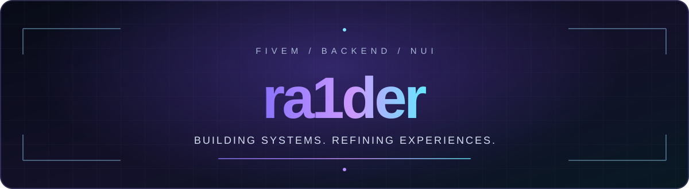

 

  

&nbsp;

&nbsp;

  

 

<h2 align="center">◈ &nbsp; ABOUT ME &nbsp; ◈</h2>

`FiveM` &nbsp;·&nbsp; `Lua` &nbsp;·&nbsp; `TypeScript` &nbsp;·&nbsp; `NUI`

I design and develop **FiveM systems** with a focus on backend architecture, 
performance, maintainability, and polished player experiences.

**Build with purpose. Optimize with care. Ship with confidence.**

 

<h2 align="center">◈ &nbsp; TECH STACK &nbsp; ◈</h2>

**Languages & Frontend**

 

**Tools & Workflow**

 

<h2 align="center">◈ &nbsp; WHAT I BUILD &nbsp; ◈</h2>

| `01 / BACKEND` | `02 / INTERFACES` |
| :---: | :---: |
| FiveM resources & server-side systems | Modern NUI with TypeScript & React |
| QBCore integrations & custom frameworks | Responsive HUDs, tablets & dashboards |
| Secure event flows & maintainable architecture | Clean, consistent UI components |

| `03 / PERFORMANCE` | `04 / DEVELOPMENT` |
| :---: | :---: |
| Optimized client/server execution | Modular, scalable resource structure |
| Profiling & reducing unnecessary overhead | Readable code & continuous iteration |

 

<h2 align="center">◈ &nbsp; GITHUB ACTIVITY &nbsp; ◈</h2>

Instead of unreliable third-party stats images, explore my live GitHub activity directly.

&nbsp;

  

GitHub displays the native contribution calendar on this profile beneath the README.

 

---

*"Consistency > Motivation."*

DESIGNED TO BUILD · BUILT TO LAST

